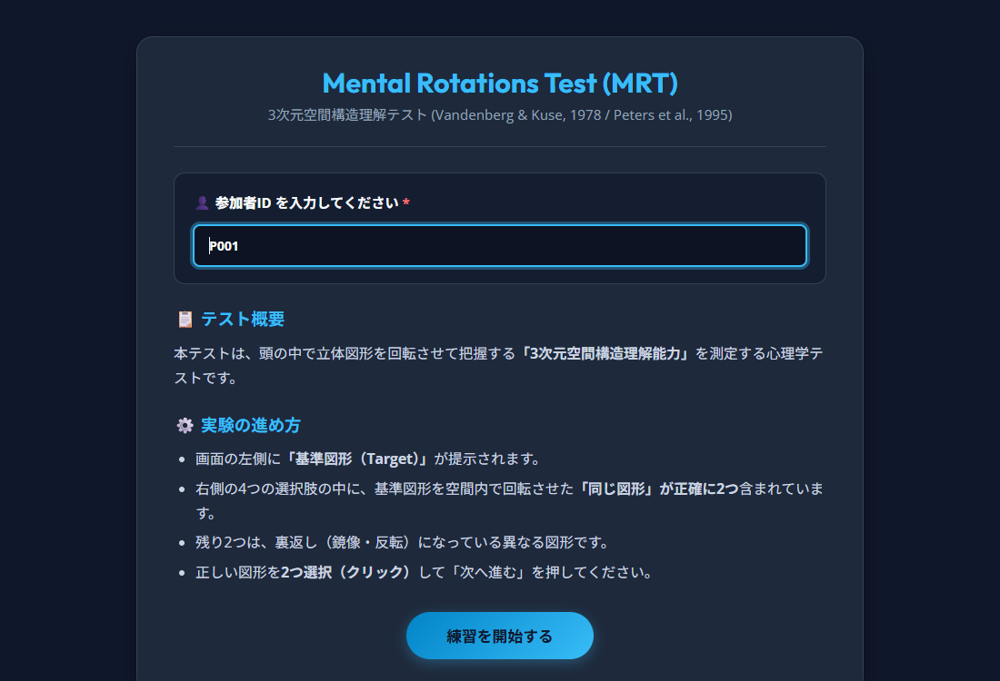
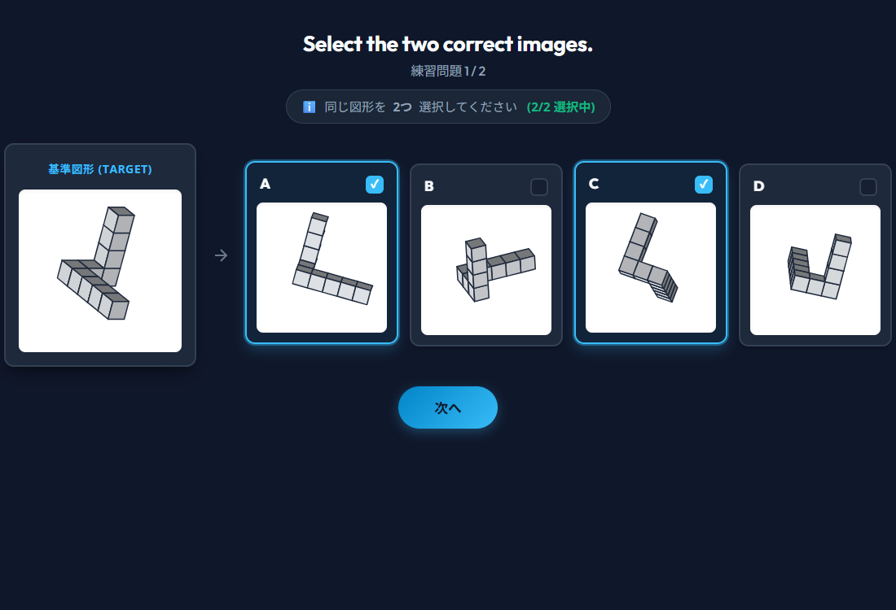

# Mental Rotations Test (MRT) - 3次元空間構造理解課題

Vandenberg & Kuse (1978) の古典的 Mental Rotations Test (MRT) および Peters et al. (1995) の再描画刺激プロトコルに基づいた、**GitHub Pages 公開用・Google フォーム連携対応の心理実験Webアプリケーション**です。

---

## 📖 実験の流れと使い方（ステップ・バイ・ステップ）

### Step 1. 参加者IDの入力とスタート

- ページを開くと、課題の概要・進め方が表示されます。
- **「参加者ID」** 欄に、氏名・学籍番号・Google フォーム等で指定されたIDを入力します。
- 入力後、**「練習を開始する」** ボタンを押すか、**Enter キー** を押して練習セッションへ進みます。
- （※ Google フォームから `?id=P001` 等の URL パラメータ付きで遷移した場合は、IDが自動で入力されます）

---

### Step 2. 課題の実施（練習 2問 / 本番 12問）

- 左側に **「基準図形（Target）」**、右側に **「4つの選択肢（A, B, C, D）」** が表示されます。
- 4つの選択肢の中から、基準図形を3次元空間内で回転させた **「同じ図形」を正確に 2つ** 選択（クリック）します。
  - キーボードの **[1, 2, 3, 4]** または **[A, B, C, D]** キーでも選択可能です。
- 2つ選択すると **「次へ」** ボタンが有効になり、次の問題へ進めます。

---

### Step 3. 練習問題の正誤確認

- 練習問題（2問）が終了すると、本番テスト開始前の画面に **練習問題の正誤一覧（あなたの回答・正解・⭕/❌判定）** が表示されます。
- 自分の回答と正解のルールを確認したら、**「本番テストを開始する」** ボタンを押して本番（全12問）に進みます。

---

### Step 4. 本番終了・正誤一覧の確認とデータコピー

- 全12問が完了すると、実験終了画面が表示されます。
- **📋 データのコピーと提出**:
  1. **「📋 データをコピーする」** ボタンを1クリックすると、全試行の詳細データ（CSV形式）がクリップボードにコピーされます。
  2. **「🚀 Google フォームを開く」** ボタンで Google フォームに戻り、回答欄に貼り付けて送信してください。
  3. （必要に応じて **「💾 CSV保存」** ボタンでバックアップファイルをダウンロードできます）
- **📊 正誤一覧の確認**:
  - 画面下部に **本番全12問の正誤一覧テーブル**（第1問〜第12問、あなたの回答、正解、⭕/❌、回答時間）が表示されます。

---

## 🎯 主な特徴

1. **Vandenberg & Kuse (1978) の 2-out-of-4 選択形式**
   - 基準図形（Target）1つに対し、4つの選択肢の中から回転させた同一図形を「2つ」選択する標準プロトコルに完全対応。
2. **`jspsych-mental-rotation` 3D Canvas 描画エンジン搭載**
   - Shepard & Metzler (1971) / Peters et al. (1995) スタイルの10個の立方体からなる3Dブロック立体を、Canvas上に高解像度かつリアルタイムに回転・鏡像描画します。
   - 外部画像ファイルが不要なため、**リポジトリを GitHub Pages にプッシュするだけで即座に完全動作**します。
3. **Google フォームとの連携設計**
   - **URLパラメータ引き継ぎ**: `https://<user>.github.io/<repo>/?id=P001` のようにアクセスすると、参加者IDを自動で記録。
   - **ワンクリック結果コピー**: 終了画面で全試行のCSVデータをクリップボードへワンクリックでコピー可能。
   - **CSVバックアップ保存**: 参加者側でのファイル保存も可能。
   - **Google フォーム直通ボタン**: 終了画面からGoogle フォームへ1クリックで戻れます。

---

## 🚀 GitHub Pages への公開手順

1. **GitHub にリポジトリを作成**
   - GitHub にログインし、新しいリポジトリ（例: `mental_rotation_test`）を作成します。
2. **本リポジトリのファイルをプッシュ**
   ```bash
   git add .
   git commit -m "Initial commit for Mental Rotations Test"
   git branch -M main
   git push -u origin main
   ```
3. **GitHub Pages を有効化**
   - リポジトリの **Settings** ＞ **Pages** に移動します。
   - **Build and deployment** の Source で **Deploy from a branch** を選択し、Branch を `main` / `/(root)` に設定して **Save** を押します。
   - 数分後、`https://<あなたのユーザー名>.github.io/<リポジトリ名>/` に公開されます。

---

## 📋 Google フォームとの連携手順

全体の流れ：
1. **Google フォーム (前半)**: 実験の説明、同意取得、参加者基本情報の入力。
2. **GitHub Pages (本アプリ)**: MRT実験を実施し、結果データをコピー。
3. **Google フォーム (後半)**: コピーした結果データを回答欄に貼り付けて送信。

### Google フォーム側の設定
1. **説明・同意セクション**を作成。
2. **実験URLの案内**:
   - `https://<あなたのユーザー名>.github.io/<リポジトリ名>/` へのリンクを掲載します。
3. **結果貼り付け欄**:
   - 質問形式を **「段落」** にして、「実験終了時に表示された結果データをここに貼り付けてください」と記載します。

---

## ⚙️ カスタマイズ設定 (`js/config.js`)

[`js/config.js`](file:///c:/Users/ok122/Webdev/mental_rotation_test/js/config.js) を編集することで、ノーコード感覚で動作を変更できます。

```javascript
const MRT_CONFIG = {
  // Google フォームのURL（参加者が戻るフォームのURL）
  googleFormUrl: "https://docs.google.com/forms/d/e/あなたのフォームID/viewform",

  // 1問あたりの選択数（デフォルト: 2）
  requiredSelections: 2,

  // 練習問題でフィードバック（正誤解説）を表示するか（true / false）
  showFeedbackInPractice: false,

  // 1問あたりの制限時間（ミリ秒、nullの場合は無制限）
  trialDuration: null,
};
```

---

## 🔬 参考文献

- Vandenberg, S. G., & Kuse, A. R. (1978). Mental rotations, a group test of three-dimensional spatial visualization. *Perceptual and Motor Skills*, 47(2), 599-604.
- Shepard, R. N., & Metzler, J. (1971). Mental rotation of three-dimensional objects. *Science*, 171(3972), 701-703.
- Peters, M., Laeng, B., Latham, K., Jackson, M., Zaiyouna, R., & Richardson, C. (1995). A redrawn Vandenberg and Kuse mental rotations test-different versions and scoring procedures. *Brain and Cognition*, 28(1), 39-58.
- Peters, M., & Battista, C. (2008). Applications of a library of 3D-models for mental rotation studies. *Behavior Research Methods*, 40(3), 803-809.
